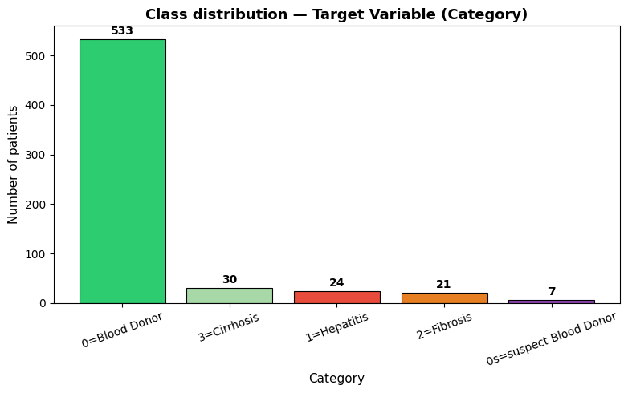
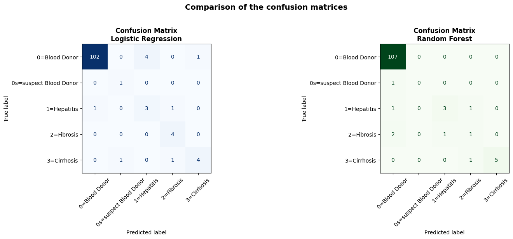
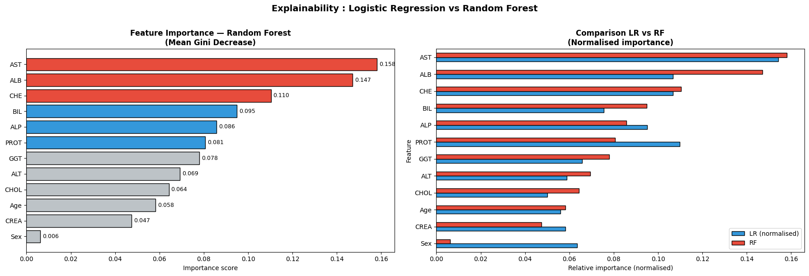

# Hepatitis C Patient Classification from Blood Biomarkers

Can routine blood tests help detect liver disease, and its stage, in patients infected with hepatitis C?
This project builds and compares two machine learning models that classify **615 patients** into five categories, from healthy blood donors to cirrhosis, using **12 laboratory and demographic variables**.

> Individual data mining project from my MSc in Biotechnology and Artificial Intelligence (Sup'Biotech × EPITA), **revisited and corrected** after a critical review of my first version (see *What I corrected* below).

## The data

- **Source**: HCV dataset, UCI Machine Learning Repository (Lichtinghagen, Klawonn, Hoffmann, 2020), file `data/HepatitisCdata.csv`.
- **Patients**: 615, with 5 classes: Blood Donor (533), Cirrhosis (30), Hepatitis (24), Fibrosis (21), Suspect Blood Donor (7).
- **Variables**: age, sex and 10 biomarkers (ALB, ALP, ALT, AST, BIL, CHE, CHOL, CREA, GGT, PROT).
- **Main challenge**: a strong class imbalance. 87% of the patients are healthy donors, so a model that always answers "healthy" would look accurate while missing every sick patient.



## Approach

1. **Exploration**: distributions, missing values, correlations between biomarkers, and outlier detection with the IQR method.
2. **Biologically informed cleaning**: outliers are kept, because they correspond to the sickest patients (removing them would have deleted every cirrhosis case).
3. **Leakage-free preprocessing**: stratified train/test split, then median imputation and standardisation fitted on the training set only.
4. **Models**: Logistic Regression and Random Forest, both with balanced class weights.
5. **Evaluation**: confusion matrices, recall, F1-score and ROC-AUC, confirmed with a stratified 5-fold cross-validation.
6. **Explainability**: logistic regression coefficients and Random Forest feature importances, interpreted from a clinical point of view.

## Results

| Model | Recall (macro), test | F1 (macro), test | Recall (macro), 5-fold CV | ROC-AUC, 5-fold CV |
|---|---|---|---|---|
| Logistic Regression | **0.84** | **0.73** | **0.68 ± 0.11** | 0.91 ± 0.05 |
| Random Forest | 0.54 | 0.57 | 0.54 ± 0.11 | **0.98 ± 0.01** |



**Key insights**

- **Logistic Regression detects sick patients best**: it found every fibrosis patient and the suspect donor in the test set, at the cost of a few false alarms.
- **Random Forest ranks patients by risk very well** (ROC-AUC of 0.98), but its default decisions favour the "healthy" answer and miss more sick patients.
- **In a medical context, recall matters most**: missing a sick patient is worse than a false alarm. Logistic Regression is the safest choice here, and Random Forest could compete with an adjusted decision threshold.
- **Both models rely on clinically meaningful biomarkers**: AST (liver damage), albumin and cholinesterase (liver function), and bilirubin.



## What I corrected

Reviewing my first version taught me as much as building it:

- **Data leakage**: the file's row-number column had been kept as a feature. Since the rows are sorted by class, it gave the answer to the models, and it was even their "most important feature". It is now removed.
- **Outlier removal**: the IQR filter deleted a third of the patients, including every cirrhosis case, which made the test set almost empty of sick patients. Outliers are now kept.
- **Imputation**: missing values were filled with class-specific medians, which uses the target. They are now filled with training-set medians, after the split.
- **Interpretation**: conclusions were rewritten to match the actual results, and a cross-validation was added because the test set contains very few sick patients.

## How to run

```bash
git clone https://github.com/<your-username>/hepatitis-c-classification.git
cd hepatitis-c-classification
pip install -r requirements.txt
jupyter notebook hepatitis_c_classification.ipynb
```

In **Google Colab**, open the notebook, then upload `data/HepatitisCdata.csv` into a `data` folder before running the cells.

## Tools

Python, pandas, NumPy, scikit-learn, Matplotlib, Seaborn, Google Colab.

## Author

**Aurélie Biaou**, MSc student in Biotechnology and Artificial Intelligence, Sup'Biotech × EPITA (Paris).
